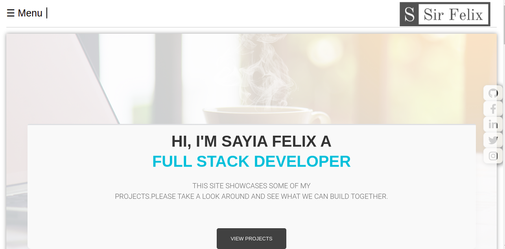
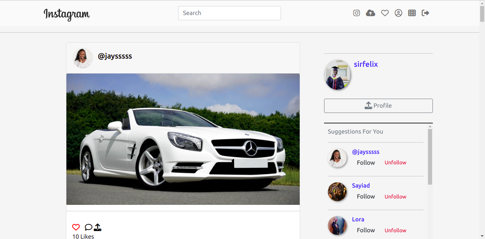
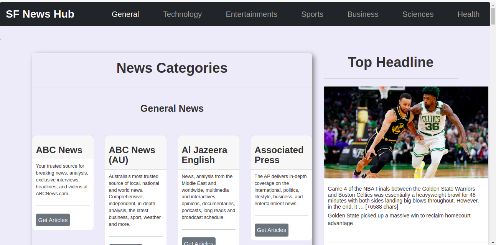
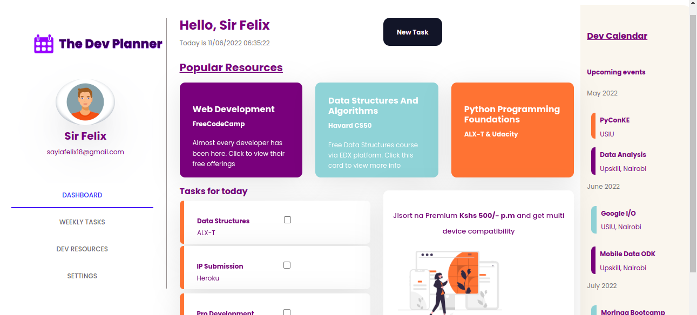
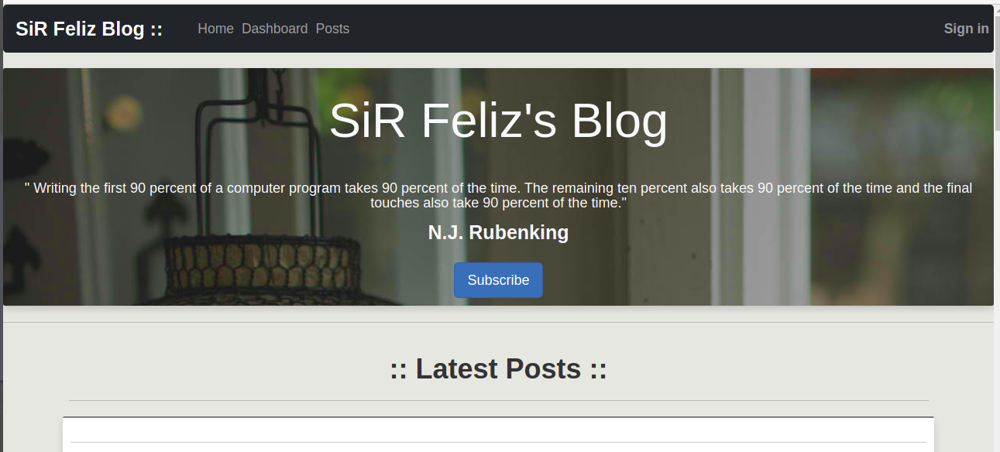
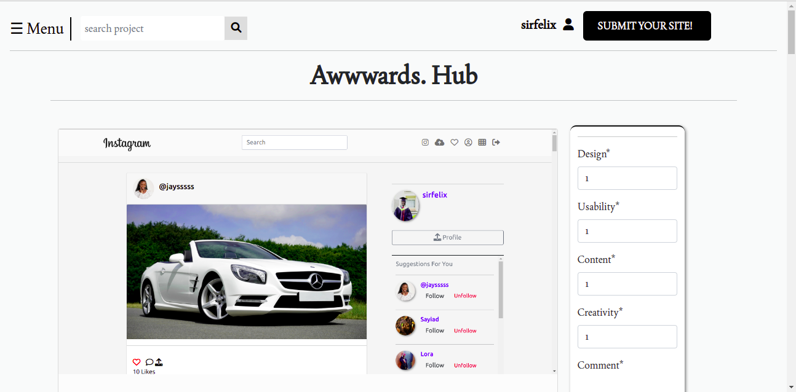

<h1 align="center"> Hello Folks! </h1>
<h2 align="center">I'm Sayia Felix Lucas</h2>
<h3 align="center">A Software Engineer from Nairobi, Kenya</h3>

 

  
  
  
 <!-- -->

 

**SayiaFelix/SayiaFelix** is a ✨ _special_ ✨ repository because its `README.md` (this file) appears on your GitHub profile.

🌱 I’m currently learning ReactJs,

👯 I’m looking to collaborate on different projects

<!--👨‍💻 All of my projects are available at [my website](https://sirfelix-portfolio.herokuapp.com/)-->

👀 Ask me about AngularJs, Flask,django and APIs

📫You can reach me at sayiafelix18@gmail.com

⚡ Fun fact  - I like mathematics and music

 
 

# Projects ⚙️
<table bordercolor="#66b2b">
  <tr>
    <td width="50%" valign="top">
      <h2 align="center">PORTFOLIO</h2>
       
       <!--<a href="https://sirfelix-portfolio.herokuapp.com/" target="_blank"> -->
          
        </a>
       
      <!-- 

           
        <!--<a href="https://sirfelix-portfolio.herokuapp.com/" target="_blank"> -->
           
            </a>
      
 -->
    </td>
    
    <td width="50%" valign="top">
        <h2 align="center">INSTAGRAM LITE</h2>
           
              
          </a>
           
   
     </td>
    </tr>
    <tr>
      <td width="50%" valign="top">
        <h2 align="center">NEWS API</h2>
           
              
          </a>
           
      
    </td>
    <td width="50%" valign="top">
      <h2 align="center">THE DEV PLANNER</h2>
         
          
        </a>
         
  
    </td>
  </tr>
  <tr>
    <td width="50%" valign="top">
        <h2 align="center">BLOG APP</h2>
         
            
          </a>
         

    </td>
    <td width="50%" valign="top">
      <h2 align="center">AWWWARDS. HUB</h2>
         
          
        </a>
         

    </td>
  </tr>
</table>

# Technologies & Tools 🔧

 

# GitHub Stats 📈

  

  

  

  

## Extras 📝
  

  
Click to expand!

   
    

 
 

  
  

  
  

     
   

[1.1]: http://i.imgur.com/tXSoThF.png (twitter icon with padding)
[2.1]: http://i.imgur.com/0o48UoR.png (github icon with padding)

[1.2]: http://i.imgur.com/wWzX9uB.png (twitter icon without padding)
[2.2]: http://i.imgur.com/9I6NRUm.png (github icon without padding)

[1]: https://github.com/SayiaFelix
[2]: https://www.linkedin.com/in/sayiafelix/

   
